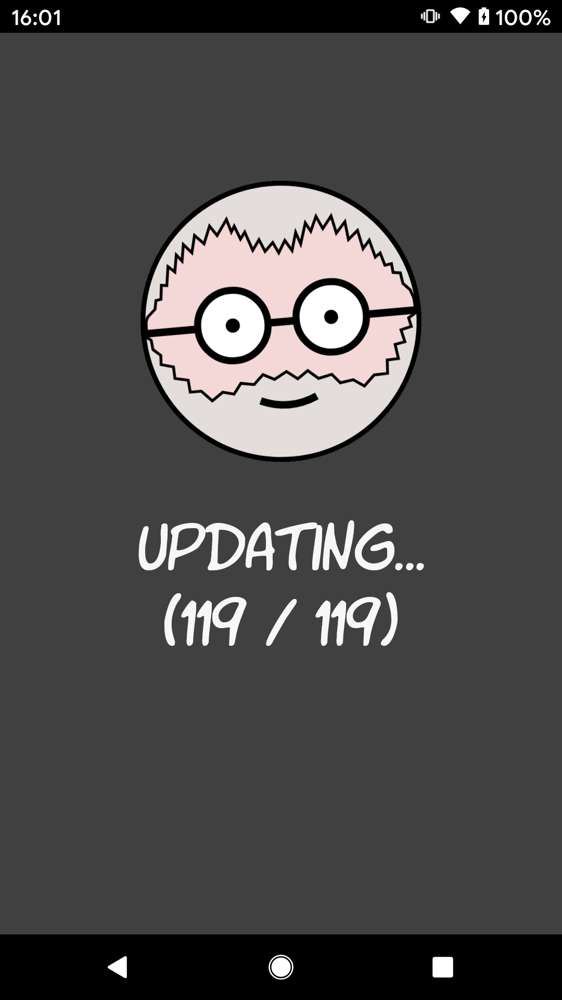
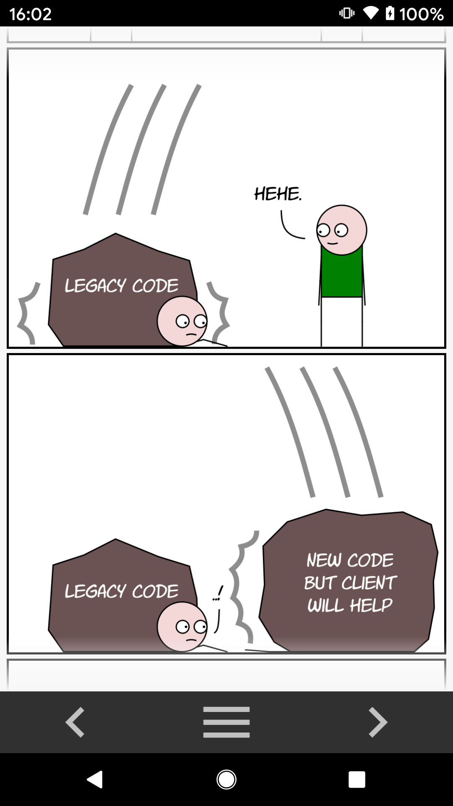
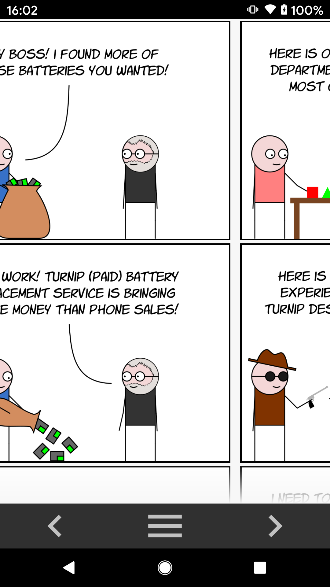
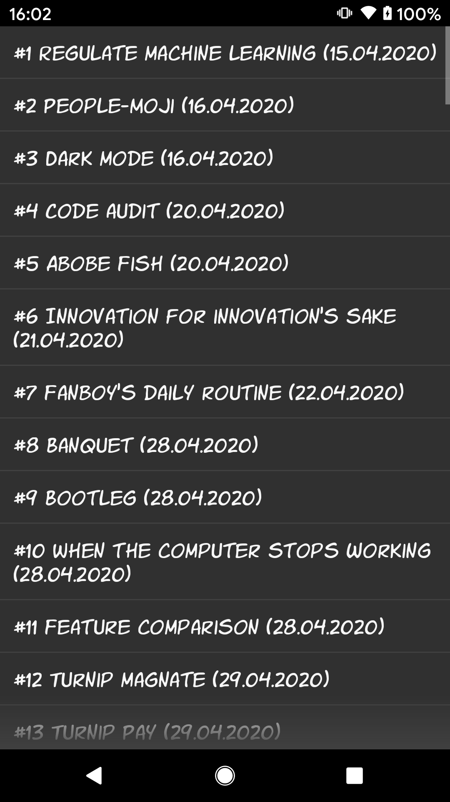

### i am steve
&nbsp;&nbsp;&nbsp;

A Flutter app for reading the "i am steve" web comic with offline support. Based on the Android version. Things missing from this one are:
- Different themes based on light/dark mode

In order to deploy it in Android Studio, set the following in "Edit Configurations", where ${FLAVOR} is for example "neocities":
- Dart entrypoint: ${YOUR_PATH_TO_PROJECT}\i_am_steve_flutter\lib\main.dart
- Additional run args: --dart-define=flavor=${FLAVOR}

In order to deploy it in command line, where ${FLAVOR} is dev/qa/uat/prod:
flutter run --dart-define=flavor=${flavor}

Command to build autogenerated code (data classes, dependency injection, etc):
flutter pub run build_runner build --delete-conflicting-outputs